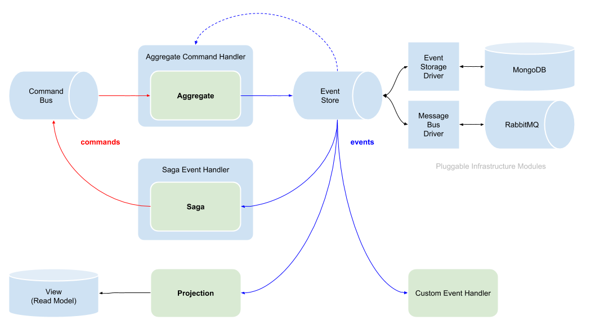

node-cqrs
=========

[](https://www.npmjs.com/package/node-cqrs)
[](http://travis-ci.org/snatalenko/node-cqrs)
[](https://coveralls.io/github/snatalenko/node-cqrs?branch=master)
[](https://www.npmjs.com/package/node-cqrs)

## Overview

The package provides building blocks for making a CQRS-ES application. It was inspired by Lokad.CQRS, but not tied to a specific storage implementation or infrastructure. It favors ES6 classes and dependency injection, so any components can be modified or replaced with your own implementations without hacks to the package codebase.

[Documentation at node-cqrs.org](https://www.node-cqrs.org)


Your app is expected to operate with loosely typed commands and events that match the following interface: 

```ts
declare interface IMessage {
    type: string,

    aggregateId?: string|number,
    aggregateVersion?: number,

    sagaId?: string|number,
    sagaVersion?: number,

    payload?: any,
    context?: any
}
```

Domain business logic should be placed in Aggregate, Saga and Projection classes:

- [Aggregates](entities/Aggregate/README.MD) handle commands and emit events
- [Sagas](entities/Saga/README.MD) handle events and enqueue commands
- [Projections](entities/Projection/README.md) listen to events and update views


Message delivery is being handled by the following services (in order of appearance):

- **Command Bus** delivers commands to command handlers
- [Aggregate Command Handler](middleware/AggregateCommandHandler.md) restores an aggregate state, executes a command
- **Event Store** persists events and deliver them to event handlers (saga event handlers, projections or any other custom services)
- **Saga Event Handler** restores saga state and applies event


From a high level, this is how the command/event flow looks like:




## Getting Started

You can find sample code of a User domain in the **/examples** folder.


### Your App → Command → Aggregate

Describe an aggregate that handles a command:

```js
const { AbstractAggregate } = require('node-cqrs');

class UserAggregate extends AbstractAggregate {
  static get handles() {
    return ['createUser'];
  }
  
  createUser(commandPayload) {
    // ...
  }
}
```

Then register aggregate in the [DI container](middleware/DIContainer.md). 
All the wiring can be done manually, without a DI container (you can find it in samples), but with container it’s just easier:

```js
const { ContainerBuilder, InMemoryEventStorage } = require('node-cqrs');

const builder = new ContainerBuilder();
builder.register(InMemoryEventStorage).as('storage');
builder.registerAggregate(UserAggregate);

const container = builder.container();
```

Then send a command:

```js
const userAggregateId = undefined;
const payload = {
  username: 'john',
  password: 'test'
};

container.commandBus.send('createUser', userAggregateId, { payload });
```

Behind the scene, an AggregateCommandHandler will catch the command, 
try to load an aggregate event stream and project it to aggregate state, 
then it will pass the command payload to the `createUser` handler we’ve defined earlier.

The `createUser` implementation can look like this: 

```js
createUser(commandPayload) {
  const { username, password } = commandPayload;

  this.emit('userCreated', {
    username,
    passwordHash: md5Hash(password)
  });
}  
```

Once the above method is executed, the emitted userCreated event will be persisted and delivered to event handlers (sagas, projections or any other custom event receptors).


### Aggregate → Event → Projection → View

Now it’s time to work on a read model. We’ll need a projection that will handle our events. Projection must implement 2 methods: `subscribe(eventStore)` and `project(event)` . 
To make it easier, you can extend an `AbstractProjection`:

```js
const { AbstractProjection } = require('node-cqrs');

class UsersProjection extends AbstractProjection {
  static get handles() {
    return ['userCreated'];
  }
  
  userCreated(event) {
    // ...
  }
}
```

By default, projection uses async `InMemoryView` for inner view, but we’ll use `Map` to make it more familiar:

```js
class UsersProjection extends AbstractProjection {
  get view() {
    return this._view || (this._view = new Map());
  }

  // ...
}
```

With `Map` view, our event handler can look this way:

```js
class UsersProjection extends AbstractProjection {
  // ...

  userCreated(event) {
    this.view.set(event.aggregateId, {
      username: event.payload.username
    });
  }
}
```

Once the projection is ready, it can be registered in the DI container: 

```js
builder.registerProjection(UsersProjection, 'users');
```

And accessed from anywhere in your app:

```js
container.users
// Map { 1 => { username: 'John' } }
```

## Contribution

* [editorconfig](http://editorconfig.org)
* [eslint](http://eslint.org)
* `npm test -- --watch`

## License

* [MIT License](https://github.com/snatalenko/node-cqrs/blob/master/LICENSE)
