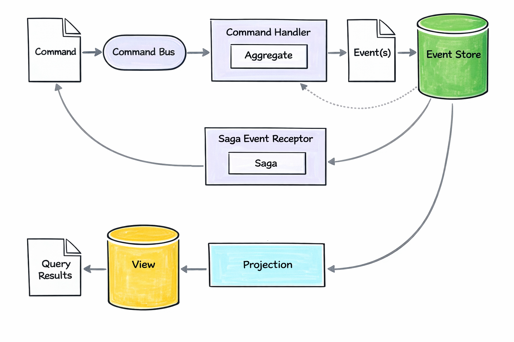

node-cqrs
=========

[](https://www.npmjs.com/package/node-cqrs)
[](https://github.com/snatalenko/node-cqrs/actions/workflows/audit.yml)
[](https://github.com/snatalenko/node-cqrs/actions/workflows/tests.yml)
[](https://coveralls.io/github/snatalenko/node-cqrs?branch=master)
[](https://www.npmjs.com/package/node-cqrs)

Infrastructure-agnostic building blocks for CQRS/ES, inspired by Lokad.CQRS.

CQRS/ES can be simple in a single process. Minimal code, no framework:
[examples/user-domain-own-implementation/index.ts](examples/user-domain-own-implementation/index.ts)

This library focuses on the "boring but hard" parts often missing from plain CQRS/ES implementations, but required in distributed environments:

- asynchronous command and event processing with safer wiring  
- persistent views with restart catch-up (checkpointing, readiness, locking)  
- aggregate snapshots  
- extensible event dispatching pipelines (encoding, persistence, distribution)

It is built around ES6/TypeScript classes and dependency injection, making components easy to replace or customize without patching the library.


## Overview

At a high level, the command and event flow looks like this:




Commands and events are loosely typed objects implementing the [`IMessage`](src/interfaces/IMessage.ts) interface:

```ts
interface IMessage<TPayload = any> {
	type: string;

	aggregateId?: string | number;
	aggregateVersion?: number;

	sagaId?: string | number;
	sagaVersion?: number;

	payload?: TPayload;
	context?: any;
}
```

Domain logic is split across three core building blocks:

- **[Aggregates](#aggregates-write-model)** - handle commands and emit events
- **[Projections](#projections-and-views-read-model)** - consume events and update views
- **Sagas** - manage processes by reacting to events and enqueueing follow-up commands

Message delivery is handled by the following components, in order:

- **[Command Bus](src/CommandBus.ts)** - routes commands to handlers
- **[Aggregate Command Handler](src/AggregateCommandHandler.ts)** - restores aggregate state and executes commands
- **[Event Store](src/EventStore.ts)** — runs the event dispatch pipeline (e.g. encoding, persistence), then publishes events to the event bus for delivery to all subscribers
- **[Saga Event Handler](src/SagaEventHandler.ts)** - restores saga state and applies events

**Tip**: the codebase is intentionally small and readable. `src/`, `tests/`, and `examples/` are good entry points for exploring behavior.

### Examples

- [examples/browser-smoke-test](examples/browser-smoke-test) - browser smoke test with in-memory storage and buses
- [examples/user-domain](examples/user-domain) - basic CJS implementation
- [examples/user-domain-own-implementation](examples/user-domain-own-implementation/index.ts) minimal, framework-free CQRS/ES example in 1 file
- [examples/user-domain-ts](examples/user-domain-ts) - basic TypeScript implementation
- [examples/worker-projection](examples/worker-projection) - projection in a worker thread

TS examples can be run with `node` without transpiling.


## Installation

```bash
npm install node-cqrs
```

### Supported environments

- Node.js 16+
- Browser (via [browserify](https://browserify.org))

### Optional peer dependencies

Required only if you use the corresponding infrastructure modules:

- SQLite: [better-sqlite3](https://www.npmjs.com/package/better-sqlite3), [md5](https://www.npmjs.com/package/md5)
- RabbitMQ: [amqplib](https://www.npmjs.com/package/amqplib)
- Worker threads: [comlink](https://www.npmjs.com/package/comlink)


## ContainerBuilder

The recommended approach is to use dependency injection to wire buses, the event store,
and your aggregates, projections, and sagas:

```ts
const builder = new ContainerBuilder<MyDiContainer>();

// In-memory implementations for local dev/tests
builder.register(InMemoryEventStorage)
	.as('identifierProvider') // EventStore dependency to generate new aggregate and saga ID's
	.as('eventStorageReader') // EventStore dependency to read events from
	.as('eventStorageWriter'); // eventStorageWriter, when provided, is automatically added to the dispatch pipeline

builder.registerAggregate(UserAggregate);
builder.registerProjection(UsersProjection, 'users');

const container = builder.container();
```

Once created, the container exposes `commandBus` for sending commands and the `users` view managed by the projection.

If you prefer not to use the DI container, the same wiring can be done manually:

<details>
<summary>Manual setup (without DI container)</summary>

```ts
const inMemoryMessageBus = new InMemoryMessageBus();
const eventStorage = new InMemoryEventStorage();
const eventStore = new EventStore({
  eventStorageReader: eventStorage,
  identifierProvider: eventStorage,
  eventDispatchPipeline: [eventStorage],
  eventBus: inMemoryMessageBus
});

const commandBus = new CommandBus();

const aggregateCommandHandler = new AggregateCommandHandler({
  eventStore,
  aggregateType: UserAggregate
});
aggregateCommandHandler.subscribe(commandBus);

const projection = new UsersProjection();
await projection.subscribe(eventStore);

const users = projection.view;
```

</details>

## Commands

Commands represent intent and are sent to the `CommandBus`:

- sent to the CommandBus explicitly
- handled by [Aggregates](#aggregates-write-model)
- may be enqueued by Sagas

Command example (raw form):

```json
{
  "type": "signupUser",
  "payload": {
    "profile": {
      "name": "John Doe",
      "email": "john@example.com"
    },
    "password": "test"
  },
  "context": {
    "ip": "127.0.0.1",
    "ts": 1503509747154
  }
}
```

The `commandBus` exposed by the container is an instance of [CommandBus](src/CommandBus.ts) and provides two methods:

- `sendRaw(command)` - sends a fully constructed command object
- `send(type, aggregateId, { payload, context })` - a shorthand helper for common cases

Example:

```ts
commandBus.send('signupUser', undefined, {
  payload: { profile, password }
});
```


## Events

Events represent facts that have already happened:

- produced by [Aggregates](#aggregates-write-model)
- persisted by the Event Store
- delivered to [Projections](#projections-and-views-read-model), Sagas, and Event Receptors

Event example:

```json
{
  "type": "userSignedUp",
  "aggregateId": 1,
  "aggregateVersion": 0,
  "payload": {
    "profile": {
      "name": "John Doe",
      "email": "john@example.com"
    },
    "passwordHash": "098f6bcd4621d373cade4e832627b4f6"
  },
  "context": {
    "ip": "127.0.0.1",
    "ts": 1503509747154
  }
}
```


## Aggregates (write model)

### IAggregate

Aggregates handle commands and emit events. The minimal aggregate contract is [IAggregate](src/interfaces/IAggregate.ts):

```ts
export interface IAggregate {

	/**
	 * Applies a single event to update the aggregate's internal state.
	 *
	 * This method is used primarily when rehydrating the aggregate
	 * from the persisted sequence of events
	 *
	 * @param event - The event to be applied
	 */
	mutate(event: IEvent): void;

	/**
	 * Processes a command by executing the aggregate's business logic,
	 * resulting in new events that capture the state changes.
	 * It serves as the primary entry point for invoking aggregate behavior
	 *
	 * @param command - The command to be processed
	 * @returns A set of events produced by the command
	 */
	handle(command: ICommand): IEventSet | Promise<IEventSet>;
}
```

### AbstractAggregate

[AbstractAggregate](src/AbstractAggregate.ts) is optional but recommended base class that provides the CQRS/ES wiring 
and covers common edge cases: state restoring, command routing, validation, snapshots.

Without an internal state it can be as simple as this:

```ts
import { AbstractAggregate } from 'node-cqrs';

type CreateUserCommandPayload = { username: string };
type UserCreatedEventPayload = { username: string };

class UserAggregate extends AbstractAggregate<void> {
	createUser(payload: CreateUserCommandPayload) {
		this.emit('userCreated', { username: payload.username });
	}
}
```

By default, `node-cqrs` infers handled message types from public method names (so `createUser()` handles the `createUser` command).

### Aggregate State

Typically, it's simplest to keep aggregate state separate from command handlers and derive it by projecting the aggregate's emitted events.

User aggregate state implementation could look like this: 

```js
class UserAggregateState {
	passwordHash: string;

	passwordChanged(event: IEvent<PasswordChangedEventPayload>) {
		this.passwordHash = event.payload.passwordHash;
	}
}
```

Each event handler is defined as a separate method, which modifies the state. Alternatively, a common `mutate(event)` handler can be defined, which will handle all aggregate events instead. 

Aggregate state **should NOT throw any exceptions**, all type and business logic validations should be performed in the Aggregate during the command processing.

Pass the state instance as a property to the AbstractAggregate constructor, or define it as a read-only stateful property in your aggregate class. State will be restored from past events upon new command delivery and will be ready for the business logic validations: 

```js
class UserAggregate extends AbstractAggregate<UserAggregateState> {

	protected readonly state = new UserAggregateState();

	changePassword(payload: ChangePasswordCommandPayload) {
		if (md5(payload.oldPassword) !== this.state.passwordHash)
			throw new Error('Invalid password');

		this.emit('passwordChanged', {
			passwordHash: md5(payload.newPassword)
		});
	}
}
```

### External Dependencies

If you are going to use a built-in [DI container](#containerbuilder), your aggregate constructor can accept instances of the services it depends on, they will be injected automatically upon each aggregate instance creation:

```js
import { ContainerBuilder, AbstractAggregate } from 'node-cqrs';

class UserAggregate extends AbstractAggregate {

  constructor({ id, authService }) {
    super({ id });

    // save injected service for use in command handlers
    this._authService = authService;
  }

  async signupUser(payload) {
    // use the injected service
    await this._authService.registerUser(payload);
  }
}

const builder = new ContainerBuilder();
builder.register(AuthService).as('authService');
builder.registerAggregate(UserAggregate);
```

## Projections and Views (read model)

Projection is an Observer, that listens to events and updates an associated View. 

### IProjection (minimal contract)

The minimal projection contract is [IProjection](src/interfaces/IProjection.ts):

```ts
interface IProjection<TView> extends IObserver {
	readonly view: TView;

	/** Subscribe to new events */
	subscribe(eventStore: IObservable): Promise<void> | void;

	/** Restore view state from not-yet-projected events */
	restore(eventStore: IEventStorageReader): Promise<void> | void;

	/** Project new event */
	project(event: IEvent): Promise<void> | void;
}
```

### AbstractProjection

[AbstractProjection](src/AbstractProjection.ts) is the recommended base class for implementing projections with handler methods and built-in subscribe/restore behavior:

```ts
import { AbstractProjection, type IEvent } from 'node-cqrs';

type UsersView = Map<string, { username: string; }>;

class UsersProjection extends AbstractProjection<UsersView> {

	constructor() {
		super();
		this.view = new Map();
	}

	userCreated(event: IEvent<UserCreatedEventPayload>) {
		this.view.set(event.aggregateId as string, {
			username: event.payload!.username
		});
	}
}
```

Same rule applies as for AbstractAggregate: `userCreated()` handles the `userCreated` event unless you override `handles`.

### View restoring on start

For persistent views and safe restarts, a default projection `view` can implement [IViewLocker](src/interfaces/IViewLocker.ts) and [IEventLocker](src/interfaces/IEventLocker.ts) to support catch-up and last-processed checkpoints.

### Accessing views

When projection is being registered in the [DI container](#containerbuilder), the default `view` can be automatically exposed with a given name:

```ts
import { ContainerBuilder, IContainer } from 'node-cqrs';

interface MyDiContainer extends IContainer {
	usersView: UsersView;
}

const builder = new ContainerBuilder<MyDiContainer>();
builder.registerProjection(UsersProjection, 'usersView');

const container = builder.container();
const userRecord = container.usersView.get('1');
```

In case projection manages multiple views, those views can be exposed to container instance manually:

```ts
builder.registerProjection(UsersProjection).as('usersProjection');
builder.register(c => c.usersProjection.users).as('usersView');
builder.register(c => c.usersProjection.connections).as('connectionsView');
```

## Infrastructure modules

### In-memory

In-memory implementations intended for tests and local development.

* [InMemoryEventStorage](src/in-memory/InMemoryEventStorage.ts)
* [InMemoryMessageBus](src/in-memory/InMemoryMessageBus.ts)
* [InMemoryView](src/in-memory/InMemoryView.ts)

### SQLite

Persistent views + catch-up/checkpoint tooling.

```ts
import { AbstractSqliteView, SqliteObjectView } from 'node-cqrs/sqlite';
```

- [AbstractSqliteView](src/sqlite/AbstractSqliteView.ts) - Base class for SQLite-backed projection views with restore locking and last-processed-event tracking
- [SqliteObjectView]() - SQLite-backed object view with restore locking and last-processed-event tracking

### RabbitMQ

Cross-process event distribution.

```ts
import { RabbitMqEventBus, RabbitMqGateway } from 'node-cqrs/rabbitmq';
```

- [RabbitMqGateway](src/rabbitmq/RabbitMqGateway.ts) — RabbitMQ-based publish/subscribe gateway for commands and events, with durable and transient queue support
- [RabbitMqEventBus](src/rabbitmq/RabbitMqEventBus.ts) - RabbitMQ-backed `IEventBus` with named queues support

### Workers

Run projections and corresponding views in `worker_threads`  to isolate CPU-heavy work and keep the main thread responsive.

```ts
import { AbstractWorkerProjection } from 'node-cqrs/workers';
```

- [AbstractWorkerProjection](src/workers/AbstractWorkerProjection.ts) - Projection base class that can run projection handlers and the associated view in a worker thread.

## Testing and Contribution

```bash
git clone git@github.com:snatalenko/node-cqrs.git
cd node-cqrs
npm install
npm test
npm run lint
```

Code style and formatting are enforced via:

- [editorconfig](http://editorconfig.org)
- [eslint](http://eslint.org)

## License

* [Apache-2.0](LICENSE)
