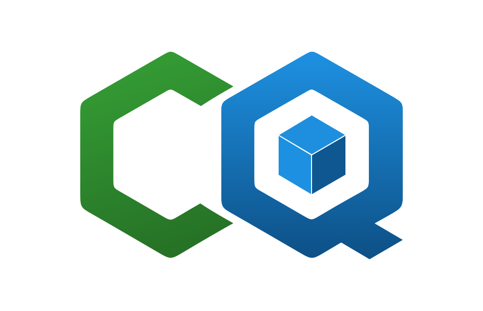
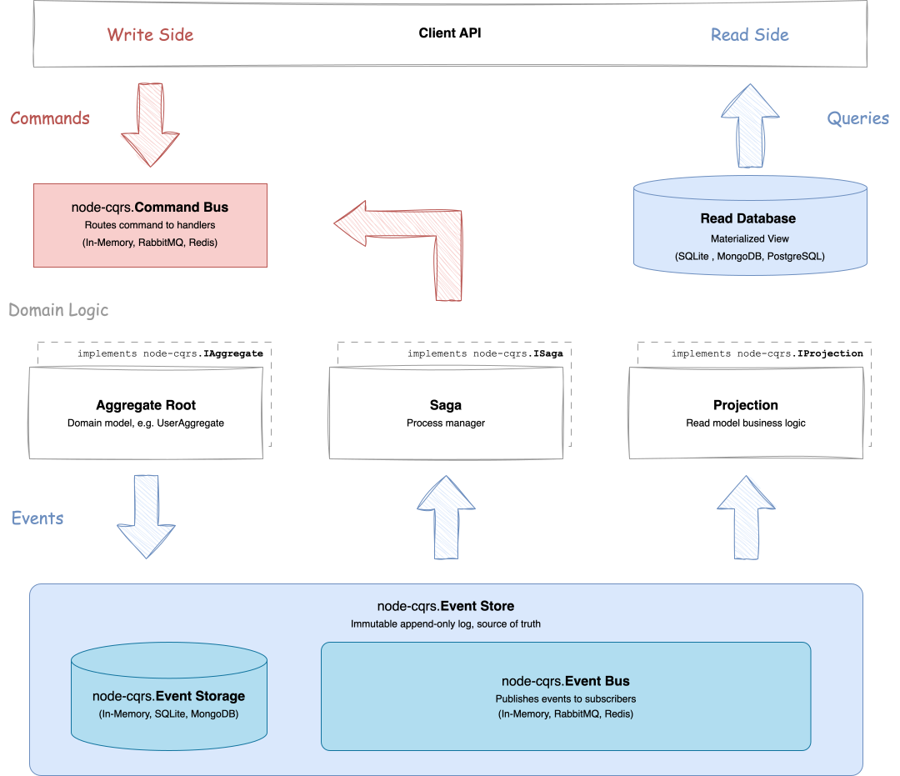

node-cqrs
=========

[](https://www.npmjs.com/package/node-cqrs)
[](https://github.com/snatalenko/node-cqrs/actions/workflows/ci.yml)
[](https://coveralls.io/github/snatalenko/node-cqrs)
[](https://www.npmjs.com/package/node-cqrs)
[](https://github.com/snatalenko/node-cqrs)

TypeScript building blocks for CQRS and Event Sourcing with aggregates, sagas, projections, dependency injection,
and pluggable persistence and messaging.

<p align="center">
  
</p>

## Features

- **Plain messages**: Commands and events are ordinary typed objects without decorators or generated classes.
- **Focused domain blocks**: Aggregates handle commands, projections build read models, and sagas coordinate work.
- **Replaceable infrastructure**: Thin interfaces let applications provide their own storage, buses, locks, views,
  and dispatch processors.
- **Concurrency handling**: Commands are serialized per aggregate within a process; persistent event stores add
  optimistic concurrency for distributed writers.
- **Projection lifecycle**: Restore hooks, readiness locks, event deduplication, and checkpoints are available to
  persistent views.
- **Selective rehydration**: Aggregates can restore selected events and use optional snapshots.
- **Dispatch pipelines**: Event batches pass through configurable persistence and processing pipelines with
  concurrency limits.

Infrastructure modules can be combined according to the deployment:

- `node-cqrs/sqlite` - embedded event storage and relational or JSON views;
- `node-cqrs/mongodb` - distributed event storage and document views;
- `node-cqrs/redis` - distributed document projection views;
- `node-cqrs/postgresql` - transactional event storage and relational or JSON views;
- `node-cqrs/rabbitmq` - distributed command and event buses;
- `node-cqrs/workers` - worker-thread projections for CPU-intensive handlers.

## Installation

```bash
npm install node-cqrs
```

The built package supports Node.js 16 and later. The TypeScript examples can be executed directly with Node.js
24 or later; earlier Node.js versions require normal TypeScript compilation or a loader.

The browser bundle exposes the browser-compatible core API. Database adapters, RabbitMQ, and Node.js worker
threads are server-side modules. Infrastructure modules require their documented peer dependencies.

## Quick Start

This example defines one command, one event, and one read model entirely in memory:

```ts
import { AbstractAggregate, AbstractProjection, ContainerBuilder, InMemoryEventStorage } from 'node-cqrs';
import type { IContainer, IEvent, Identifier } from 'node-cqrs';

type UserRecord = {
	username: string;
};

type UserCreatedEvent = IEvent<UserRecord>;
type UsersView = Map<Identifier, UserRecord>;

class UserAggregate extends AbstractAggregate {
	createUser(payload: UserRecord) {
		this.emit('userCreated', payload);
	}
}

class UsersProjection extends AbstractProjection<UsersView> {
	constructor() {
		super({ view: new Map() });
	}

	userCreated(event: UserCreatedEvent) {
		this.view.set(event.aggregateId!, event.payload);
	}
}

interface AppContainer extends IContainer {
	usersView: UsersView;
}

const builder = new ContainerBuilder<AppContainer>();
builder.register(InMemoryEventStorage);
builder.registerAggregate(UserAggregate);
builder.registerProjection(UsersProjection, 'usersView');

const container = builder.container();
const { usersView, commandBus } = container;

const [userCreated] = await commandBus.send('createUser', undefined, {
	payload: { username: 'alice' }
});

console.log(usersView.get(userCreated.aggregateId!)); // { username: 'alice' }
```

`InMemoryEventStorage` is useful for learning and tests; its events disappear when the process exits. Choose a
persistent event store from [Infrastructure](#infrastructure) for an application that must survive restarts.

## How It Fits Together



Domain behavior is split into three small blocks:

- **[Aggregates](#aggregates)** restore write-side state, validate commands, and emit events.
- **[Projections](#projections-and-views)** consume events and update read-side views.
- **[Sagas](#sagas)** react to events and enqueue commands for multi-step processes.

The default runtime flow is:

1. The command bus delivers a command to an aggregate command handler.
2. The handler restores the target aggregate and invokes its command method.
3. Emitted events pass through the event dispatch pipeline, including configured persistence.
4. The event bus delivers committed events to projections, sagas, and other subscribers.

## Messages And Replacement Points

Commands and events are plain objects. A message needs only a type and payload; identifiers, context, aggregate
versions, and saga origins are added when the workflow needs them:

```ts
type Message<TPayload> = {
	type: string;
	aggregateId?: Identifier;
	payload: TPayload;
	context?: unknown;
};

const command: Message<{ username: string }> = {
	type: 'createUser',
	payload: { username: 'alice' }
};
```

Library blocks are similarly narrow. For example, a projection only needs a view and three lifecycle methods:

```ts
interface Projection<TView> {
	readonly view: TView;
	subscribe(eventStore: IObservable): void | Promise<void>;
	restore(eventStore: IEventStorageReader): void | Promise<void>;
	project(event: IEvent): void | Promise<void>;
}
```

Applications can implement these contracts directly or extend the supplied base classes:

| Contract | Replace it to customize |
|---|---|
| [`ICommandBus`](src/interfaces/ICommandBus.ts) | Command transport and routing |
| [`IEventBus`](src/interfaces/IEventBus.ts) | Event broadcast and worker queues |
| [`IEventStorageReader`](src/interfaces/IEventStorageReader.ts) | Aggregate, saga, and projection event reads |
| [`IDispatchPipelineProcessor`](src/interfaces/IDispatchPipelineProcessor.ts) | Persistence, encoding, validation, or event augmentation |
| [`IProjection`](src/interfaces/IProjection.ts) | Projection routing and view ownership |
| [`IViewLocker`](src/interfaces/IViewLocker.ts) | Projection restore coordination |
| [`IEventLocker`](src/interfaces/IEventLocker.ts) | Event deduplication and projection checkpoints |

The [framework-free example](examples/user-domain-framework-free/index.ts) implements the core interfaces without
using the supplied aggregate or projection base classes.

## Aggregates

`AbstractAggregate` maps public method names to command types. This aggregate handles a `createUser` command and
emits a `userCreated` event:

```ts
class UserAggregate extends AbstractAggregate {
	createUser(payload: { username: string }) {
		this.emit('userCreated', { username: payload.username });
	}
}
```

Override `static handles` when command types should be declared explicitly.

### Aggregate State

State is rebuilt by applying the aggregate's historical events. Keep mutation deterministic and validate in the
command method before emitting a new event:

```ts
class UserState {
	username!: string;

	userCreated(event: IEvent<{ username: string }>) {
		this.username = event.payload.username;
	}

	userRenamed(event: IEvent<{ username: string }>) {
		this.username = event.payload.username;
	}
}

class UserAggregate extends AbstractAggregate<UserState> {
	protected readonly state = new UserState();

	renameUser(payload: { username: string }) {
		if (payload.username === this.state.username)
			throw new Error('Username is unchanged');

		this.emit('userRenamed', payload);
	}
}
```

Constructor dependencies are resolved from the container, so domain behavior can use application services
without service locators:

```ts
type UserAggregateOptions = IAggregateConstructorParams<void> & {
	authService?: AuthService;
};

class UserAggregate extends AbstractAggregate {
	readonly #authService: AuthService;

	constructor({ authService, ...options }: UserAggregateOptions) {
		super(options);
		if (!authService)
			throw new TypeError('authService is required');

		this.#authService = authService;
	}
}

interface AggregateContainer extends IContainer {
	authService: AuthService;
}

const builder = new ContainerBuilder<AggregateContainer>();
builder.register(AuthService).as('authService');
builder.registerAggregate(UserAggregate);
```

## Projections And Views

`AbstractProjection` maps event types to methods in the same way:

```ts
class UsersProjection extends AbstractProjection<Map<Identifier, UserRecord>> {
	constructor() {
		super({ view: new Map() });
	}

	userCreated(event: IEvent<UserRecord>) {
		this.view.set(event.aggregateId!, event.payload);
	}
}
```

Override `static handles` to declare event types explicitly.

Expose a projection view through the typed container and wait for startup restoration before serving reads:

```ts
interface AppContainer extends IContainer {
	usersView: Map<Identifier, UserRecord>;
}

const builder = new ContainerBuilder<AppContainer>();
builder.registerProjection(UsersProjection, 'usersView');

const container = builder.container();
await Promise.all(container.restorePromises ?? []);

const usersView = container.usersView;
```

Persistent projection implementations provide restore locking, event deduplication, and checkpoints. Their exact
transaction and retry guarantees are documented by each infrastructure module.

## Sagas

Sagas coordinate multi-step work by handling events and producing follow-up commands:

```ts
class WelcomeEmailSaga extends AbstractSaga {
	userSignedUp(event: IEvent<{ email: string }>) {
		this.enqueue('sendWelcomeEmail', undefined, {
			email: event.payload.email
		});
	}
}

builder.registerSaga(WelcomeEmailSaga);
```

Starter events use `event.id` as the saga origin; the default dispatch pipeline assigns missing IDs automatically.

By default, a saga starts when a handled event has no origin for that saga type. Use `static startsWith` for
explicit starter event types, `static handles` for additional events, and `static sagaDescriptor` for a stable
origin key independent of the class name.

The [simple saga](examples/sagas-simple/index.ts) and
[overlapping sagas](examples/sagas-overlaps/index.ts) demonstrate state restoration and origin propagation.

## Event Dispatch Pipeline

Before publishing events, `EventStore` runs a pipeline for cross-cutting work. `ContainerBuilder` provides defaults that assign missing event IDs, persist events, and save snapshots when the corresponding storage processors are registered.

Extend the defaults with another processor:

```ts
builder.register(c => [
	...c.defaultEventDispatchPipeline,
	c.createInstance(AuditProcessor)
]).as('eventDispatchPipeline');
```

Omit the defaults to replace the pipeline entirely:

```ts
builder.register(c => [
	c.eventIdAugmenter,
	c.createInstance(CustomStorageWriter)
]).as('eventDispatchPipeline');
```

Pipeline registrations replace earlier registrations, so the last one wins. A replacement must include every required processor, including `eventIdAugmenter` when consumers need event IDs. Extend `defaultEventDispatchPipeline`, not `eventDispatchPipeline`, from its own factory to avoid a circular dependency. Named pipelines supplied through `eventDispatchPipelines` are also explicit and do not inherit the defaults.

`eventIdAugmenter` only fills in missing IDs, keeping IDs already assigned to events and IDs returned by the `IIdentifierProvider` as they are, whether they are strings, numbers or objects. Components that need a string key, such as saga correlation, projection locks and transport metadata, stringify the ID at their own boundary and never modify the event, so object IDs must have a stable and unique string representation. Storage modules add their own requirements: MongoDB event storage needs ObjectId-compatible IDs, SQLite event storage needs GUID-compatible ones.

## Runtime Lifecycle And Guarantees

Container dependencies are resolved lazily. Access each exposed projection view during startup to create its
projection, subscribe it to the event store, and start restoration. Then await `restorePromises` before accepting
requests that depend on those views. Destructuring exposed views from the container, as in the quick start, performs
that initial resolution.

Event dispatch has two stages:

1. `commandBus.send()` waits for command handling and the configured dispatch pipeline, including event storage.
2. Event-bus publication runs asynchronously after pipeline processing so command throughput is not tied to every
   subscriber.

Use `await eventStore.drain()` when a caller, test, or shutdown path must wait for all currently queued event
publications. A completed command does not otherwise guarantee that every projection has finished processing its
events. Configure `eventPublishErrorHandler` when publication failures must be logged or reported; draining waits
for publication attempts but does not make subscriber handling part of the storage transaction.

Infrastructure determines distributed guarantees:

- In-memory locks and buses coordinate only one process.
- Persistent event stores define transaction boundaries and optimistic concurrency behavior.
- Persistent views define restore locking, event deduplication, retries, and checkpoint semantics.
- RabbitMQ can redeliver acknowledged-late messages, so distributed handlers should be idempotent.

Review the selected module documentation before relying on a specific failure or multi-instance behavior.

## Infrastructure

Choose infrastructure by deployment need. Modules can be used independently or combined.

| Need | Module | Deployment | Peer dependency |
|---|---|---|---|
| Learning, tests, and ephemeral state | `node-cqrs` | One process | - |
| Embedded event storage and views | [`node-cqrs/sqlite`](src/sqlite) | One process | `better-sqlite3` |
| Distributed event storage and document views | [`node-cqrs/mongodb`](src/mongodb) | Multiple instances | `mongodb` |
| Distributed document projection views | [`node-cqrs/redis`](src/redis) | Multiple instances | `ioredis` |
| Transactional event storage and relational views | [`node-cqrs/postgresql`](src/postgresql) | Multiple instances | `pg` |
| Distributed command and event delivery | [`node-cqrs/rabbitmq`](src/rabbitmq) | Multiple instances | `amqplib` |
| CPU-intensive projections | [`node-cqrs/workers`](src/workers) | One application process | `comlink` |

MongoDB, Redis, and PostgreSQL support is currently experimental and has not yet been validated in production.
Their APIs may change in minor versions.

### Event Storage

| Implementation | Notes |
|---|---|
| `InMemoryEventStorage` | Data is lost on restart; intended for learning and tests |
| `SqliteEventStorage` | Embedded storage for a single application process |
| `MongoEventStorage` | Distributed document event storage |
| `PostgresqlEventStorage` | Distributed transactional event storage |

See the [SQLite example](examples/sqlite/index.ts),
[MongoDB event-storage example](examples/mongodb-eventstore/index.ts), and
[PostgreSQL example](examples/postgresql/index.ts).

## Advanced: Manual Composition

The container is optional. The same components can be assembled directly:

```ts
const commandBus = new InMemoryMessageBus();
const eventBus = new InMemoryMessageBus();
const eventStorage = new InMemoryEventStorage();
const eventStore = new EventStore({
	eventStorageReader: eventStorage,
	identifierProvider: eventStorage,
	eventDispatchPipeline: [eventStorage],
	eventBus
});

const aggregateHandler = new AggregateCommandHandler({
	aggregateType: UserAggregate,
	eventStore
});
aggregateHandler.subscribe(commandBus);

const projection = new UsersProjection();
projection.subscribe(eventStore);
await projection.restore(eventStore);

const [userCreated] = await commandBus.send('createUser', undefined, {
	payload: { username: 'alice' }
});
await eventStore.drain();

console.log(projection.view.get(userCreated.aggregateId!));
```

## OpenTelemetry

Register a tracer factory to enable spans across commands, event dispatch, projections, sagas, storage adapters,
and RabbitMQ transport. Install `@opentelemetry/api` alongside the library:

```ts
import { trace } from '@opentelemetry/api';

builder.register(() => (name: string) => trace.getTracer(`cqrs.${name}`)).as('tracerFactory');
```

See the [telemetry example](examples/telemetry/index.ts) for a complete setup with exporters.

The project was inspired by [Lokad.CQRS](https://github.com/Lokad/lokad-cqrs).
